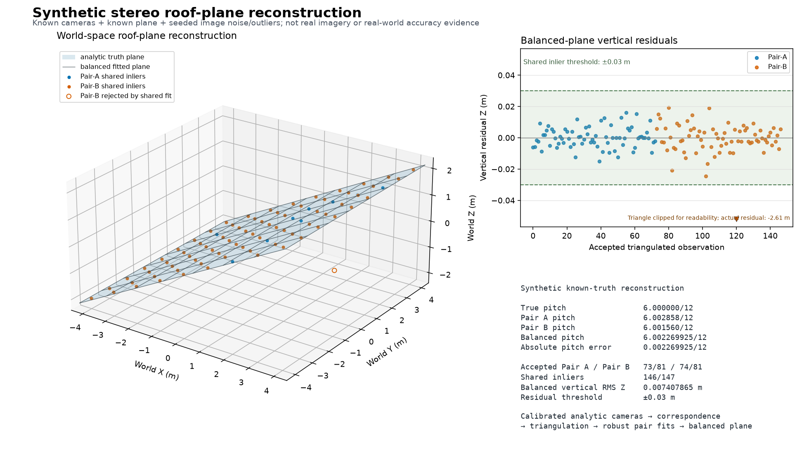
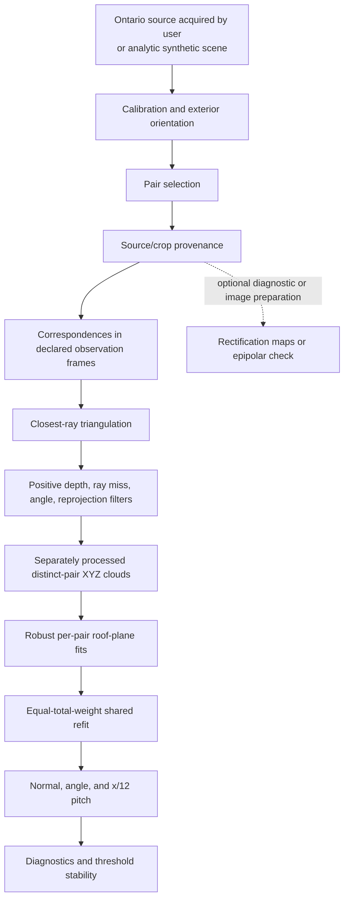

# Aerial Stereo Roof Pitch

`aerial-stereo-roof-pitch` is a standalone experimental Python photogrammetry
pipeline for reconstructing roof-plane orientation from calibrated overlapping
aerial images. It triangulates world-space points from stereo evidence, fits the
same physical roof plane across distinct image pairs, and converts the recovered
plane normal into roof pitch. The pitch comes from explicit calibrated stereo
geometry—not an AI model guessing from image appearance.

The repository includes deterministic synthetic known-truth validation of the
mathematics and software under declared analytic cameras, noise, and outliers.
It does not yet claim real-roof pitch accuracy, contractor-grade accuracy,
Ontario-wide reliability, validated aerial measurement, or production
readiness.

> Agreement between stereo pairs demonstrates internal geometric consistency,
> not independent measurement accuracy.

This is research software, not production measurement software. It does not
depend on RoofBench or private application code.



*Synthetic known-truth reconstruction: calibrated stereo observations are
triangulated into world-space points, robustly fit to a physical plane, and
converted to pitch. In the displayed seeded 6/12 case, true pitch is 6.000000/12
and balanced recovered pitch is 6.002269925/12. This is synthetic validation,
not a real property.*

## Why I Built This

A single nadir image can support two-dimensional roof tracing, but roof pitch is
a physical three-dimensional orientation. Overlapping calibrated images provide
parallax: matched image observations define rays, ray geometry reconstructs XYZ
points, and points on one roof face constrain a plane. Making every frame,
filter, rejection, and conversion visible is essential to reviewing whether the
result is geometrically coherent.

## Pipeline



## Install and run the synthetic known-truth example

Python 3.11+ is supported. The recorded golden scientific environment uses the
locked NumPy version. From a fresh checkout:

```bash
python3 -m venv .venv
source .venv/bin/activate
python -m pip install --upgrade pip
python -m pip install -r requirements-lock.txt
python -m pip install -e ".[test]"
python scripts/run_example.py --check examples/expected_summary.json
pytest -q
cmp outputs/example/summary.json examples/expected_summary.json
```

The example defaults to the new path `outputs/example` and refuses to overwrite
it. Remove or choose a different output directory before rerunning. The concise
terminal table reports truth, Pair A, Pair B, balanced pitch, error, accepted and
shared inliers, vertical RMS Z, and the scored/refused verdict. JSON and SVG
artifacts retain the machine-readable detail.

The deterministic experiment includes noiseless planes at 0/12, 4/12, 6/12,
8/12, and 12/12; a declared seeded noise/outlier scene; and a deliberately
degenerate stereo scene that must refuse. The tracked summary records scored,
refused, failed, and missing scenes separately. Synthetic truth checks pipeline
correctness under the declared camera/noise model; it does not validate accuracy
on real aerial imagery.

## Method in brief

Each pinhole camera maps world XYZ through a declared world-to-camera rotation,
camera center, and intrinsic matrix. A correspondence is back-projected into two
world rays. Their closest points produce an XYZ midpoint and a ray-miss distance;
positive depth, intersection angle, and reprojection errors are reported and
filtered. Pair A and Pair B are separately processed distinct stereo evidence
before any shared fit; they are not assumed statistically independent.

The fitted roof face is

```text
Z = a(X - Xref) + b(Y - Yref) + Zref
```

with upward unit normal `n = normalize([-a, -b, 1])`. The slope magnitude is
`sqrt(a²+b²)`, angle is `atan(slope)`, and pitch is `12*slope` inches of rise per
12 inches of run. RANSAC exposes threshold, inliers, support, RMS residual, XY
spread, and rejection reasons. A shared refit gives each accepted pair equal
total weight, so duplicating all observations in one pair cannot give that pair
more influence. The common model must retain support and XY spread in every pair,
and actual convex support footprints must overlap. Per-pair common-model metrics
and pairwise overlap fractions remain visible. See
[methodology](docs/methodology.md).

## Private Ontario context (not ground truth)

A separate Ontario SCOOP case study has been reconstructed privately. It is
intentionally excluded from this release pending publication/data review and
independent ground-truth validation. No case metrics, target imagery,
coordinates, orientation material, or target-derived artifacts are included.

## Ontario data

The acquisition lane is the **South Central Ontario Orthophotography Project
(SCOOP) 2023** from the Ontario Ministry of Natural Resources / Land Information
Ontario. This repository never downloads, copies, or redistributes it. Users must
obtain imagery and aerial-triangulation/orientation material through the official
record and document their rights. Required attribution is: “Contains information
licensed under the Open Government Licence – Ontario.” See
[Ontario data and rights](docs/ontario-data.md) and the safe
[`ontario-scoop-example.json`](examples/ontario-scoop-example.json) template.

## Validation philosophy

Pair agreement, low residuals, low ray miss, and threshold stability can expose
contradictions and establish internal consistency within the same calibration
and imagery system. They cannot reveal shared systematic errors in calibration,
orientation, matching, roof-face selection, or datum. Independent accuracy needs
an independently acquired, traceable roof-pitch reference with declared
uncertainty and a multi-roof evaluation design. The unit of analysis here is a
synthetic scene. Stereo pairs and reconstructed points are within-scene evidence,
not independent evaluation samples.

## Boundaries and limitations

- Crop/source transforms are explicit; incompatible frames refuse rather than
  silently reinterpret pixels.
- Real dense image matching and plots are optional (`images` and `plots` extras)
  and imported lazily. The core CSV/synthetic path uses only NumPy.
- Rectification maps are diagnostic image-preparation outputs, not triangulation
  cameras. Rectified pixels require a separately derived explicit camera/frame
  model, which this repository does not implement.
- Occlusion, vegetation, shadows, low texture, repeated shingles, orientation and
  calibration error, disparity ambiguity, and mixed roof faces remain hazards.
- The tracked noisy result is one fixed seed, analytic camera arrangement, and
  single planar face. It is not a population estimate, uncertainty interval, or
  evidence of generalization.
- The Ontario path is operator-supplied and not claimed to be fully automatic.
- Source imagery, derived target imagery, exact orientations, calibration
  reports, coordinates, hashes, and private results are excluded.

Code is MIT licensed. `examples/example_config.json`,
`examples/expected_summary.json`, `examples/synthetic/*`, and
`results/synthetic/*`, plus the generated
`docs/assets/synthetic-roof-plane-reconstruction.png`, are project-created
synthetic material dedicated to the public domain under CC0 terms described in
`examples/synthetic/README.md`. The renderer and all other repository code remain
MIT licensed.
Ontario source data retains the Open Government Licence – Ontario; third-party
calibration documents are not redistributed.

## Relationship to MeasureAgent

This research originated while investigating imagery-derived roof measurements
for [MeasureAgent](https://measureagent.ca); the commercial application remains
private and is not required by this repository.

Author profile: [github.com/Quinnytrott](https://github.com/Quinnytrott)
